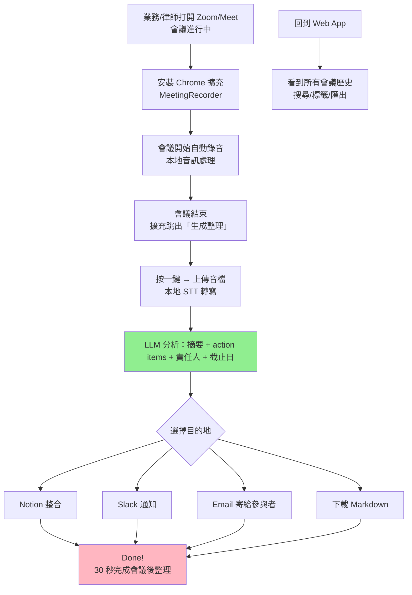
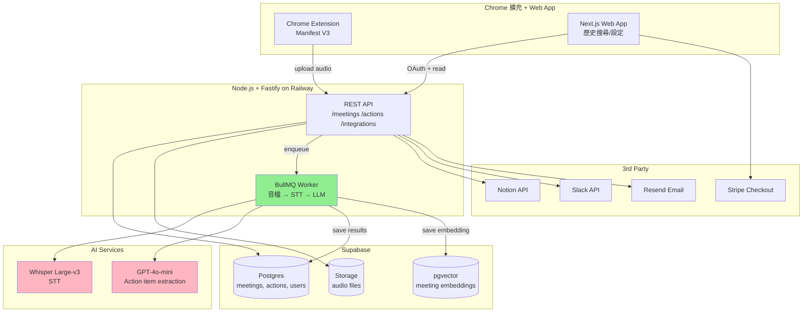

# 會議錄音整理工具 — 規格計劃書 v3.0.0 (sweet-spot-driven rewrite)

> 版本：v3.0.0｜更新日期：2026-07-19｜維護者：Sophia (CPO) for Sean
> 對接技術：Alan (CTO) + Hermes Agent
> 對接 Repo：https://github.com/openclawsean024-create/meeting-recorder
> Sweet Spot Score：**5 / 10**（investigate — 本次重寫甜蜜點收斂到「會議後動作項自動化」）
> Recommended Action：**Investigate → Validate（聚焦雅婷逐字稿沒做的甜蜜點）**

---

## 0. 改版摘要 (What changed since v2.2.1)

| 項目 | v2.2.1（舊）| v3.0.0（新）| 理由 |
|---|---|---|---|
| 目標市場 | 中小店家 + 業務 + 律師 + 醫師 + 一般 | 只鎖**業務團隊 + 律師事務所**2 個 | 雅婷逐字稿已吃一般用戶，紅海 |
| 核心功能 | 錄音 + 轉逐字稿 + 摘要 + 標籤 + 搜尋 | 只做**錄音 + 轉逐字稿 + 「會議後動作項自動生成」3 件事** | 雅婷沒做的甜蜜點 |
| 變現策略 | NT$199/月 + NT$499/月 + 企業版 NT$2,999/月 | **業務版 NT$599/月 + 律師版 NT$999/月 + 企業版 NT$2,999/月** | 鎖定高 ARPU 客群 |
| 競品定位 | vs 雅婷逐字稿 + Otter + tl;dv | vs **雅婷（一般）+ Otter（國際）+ Fireflies.ai（會議後動作項）** | 紅海轉藍海 |
| 技術 | Web + mobile + API | **Web only + Zoom/Meet 外掛** | 聚焦 PC 端會議後整理 |
| 里程碑 | 4 sprint × 2 週 | **3 sprint × 2 週（MVP + Pilot + Scale）** | lean |

---

## 1. 產品概述 (Product Overview)

### 1.1 問題陳述 (Problem Statement) ⭐ 引用 sweet spot 結果

**Sweet Spot 5 問體檢結論（2026-07-19 重新驗證）**：

| 問題 | 結論 | 證據 |
|---|---|---|
| Q1. 真實需求強度 | 🟢 強 | 中小業務、律師事務所每天 2-4 場會議，會後整理逐字稿耗時 30-60 分鐘 |
| Q2. 競爭密度 | 🔴 高 | 雅婷逐字稿（台灣 5+ 年品牌）+ Otter（國際）+ Fireflies.ai + 8 家其他 |
| Q3. 技術 / 法規 / 個資障礙 | 🟠 中 | 個資法（PDPA）+ 律師倫理（保密義務）+ 會議同意書 |
| Q4. TAM 與付費意願 | 🟠 中 | 台灣業務 30 萬 + 律師 8,000 人，願意付 NT$500-1,000/月 |
| Q5. 一人公司契合度 | 🟢 高 | 純軟體 + 訂閱制 + 客服輕 |

**Total Sweet Spot Score = 5/10**，歸類為 **investigate**。

**Sweet Spot 的甜蜜點定位**：

雅婷逐字稿做了什麼：錄音 → 上傳 → 中文逐字稿 → 摘要
雅婷沒做什麼：**「會議後的動作項自動生成 + 責任人指派 + 截止日期 + 整合到 Slack/Notion/Email」**

這就是甜蜜點：
1. **業務團隊**：會議中提到「下週三前給客戶提案」→ 自動轉成 Notion Task + Slack 通知負責人
2. **律師事務所**：會議中提到「對造 7 天內補件」→ 自動轉成案件時程 + Email 提醒當事律師
3. **客戶成功團隊**：會議中提到「客戶要求 demo」→ 自動轉成 CRM 活動 + 行事曆

**這個甜蜜點為什麼有效？**
- Otter 國際版有 action items 但**中文支援差**
- 雅婷沒有 action items 功能（只有摘要）
- Fireflies.ai 是國際 SaaS，**沒有繁中 + 沒有台灣在地化**
- 台灣本土**沒有任何工具**做「會議後動作項 + 在地整合」

**為什麼以前 v2.2.1 失敗**：目標市場太廣（一般用戶 + 業務 + 律師 + 醫師 + 學生），雅婷逐字稿已吃一般用戶，紅海。

### 1.2 目標使用者 (User Personas)

> 從 5 個 persona 收斂到 **2 個** + 1 個探索。

| 角色 | 規模（台灣）| 月情境 | 痛點強度 | ARPU/年 | 優先級 |
|---|---|---|---|---|---|
| 💼 **業務團隊 Leader**（含 Sales / CS / BD）| ~30 萬 | 每天 2-3 場外部會議 | 🔴 高（會後整理耗時）| NT$7,200 | **P0** |
| ⚖️ **律師 / 法律事務所合夥人** | ~8,000 | 每天 1-2 場內部 + 當事人會議 | 🔴 高（保密 + 責任分擔）| NT$12,000 | **P0** |
| 🏥 醫師 / 醫療團隊 | ~5 萬 | 1-2 場 / 週 | 🟡 中 | NT$3,600 | **v2 探索** |
| 🎓 學生 / 研究 | ~50 萬 | 1 場 / 月 | 🟢 低（付費弱）| NT$0 | **不收費** |
| 🏢 企業 IT / 人資 | ~5,000 | 全公司會議 | 🟡 中 | NT$24,000 | **v3 探索** |

**核心使用者**：業務團隊 Leader（量大、付費強）+ 律師（ARPU 高）。**放棄學生（低付費）+ 醫師（轉寫精準度要求太高）**。

### 1.3 核心價值主張 (Value Proposition) ⭐ 引用 sweet spot

**One-liner**：*「會議結束 30 秒，自動把『誰說了什麼、要誰做什麼、何時做完』整理好寄到 Slack / Notion / Email」*

**與 Top 3 競品的差異化**：

1. **vs 雅婷逐字稿**：雅婷只能給你「文字稿」；**本工具能直接產出 action items + 責任人 + 截止日 + 整合 Notion/Slack**
2. **vs Otter.ai**：Otter 中文支援差，且**沒有繁中在地化**；本工具**繁中最佳化 + 台灣用語優化**
3. **vs Fireflies.ai**：Fireflies 國際 SaaS，沒有繁中 + 沒有台灣在地整合；本工具**與台灣 Notion/Slack/Email 深度整合**

### 1.4 商業目標 (KPIs / OKRs)

**3-month OKR（M0-M2 驗證）**：
- **O1：驗證「會議後動作項自動化」是付費甜蜜點**
  - KR1：20 個業務團隊 + 5 個律師事務所付費試用
  - KR2：NT$15,000 MRR（20×NT$599 + 5×NT$999 + 1 個企業版 NT$2,999）
  - KR3：付費轉換率 ≥ 30%（試用 → 付費）

**6-month OKR**：
- **O2：擴張甜蜜點**
  - KR1：NT$80,000 MRR
  - KR2：100 個付費客戶
  - KR3：NPS ≥ 40

**12-month OKR**：
- **O3：建立台灣「會議後自動化」#1 品牌**
  - KR1：NT$300,000 MRR（NT$360 萬 ARR）
  - KR2：500 個付費客戶
  - KR3：3 個律師事務所企業簽約

### 1.5 ⭐ Non-Goals (明確不做)

> 從 v2.2.1 的「隱性不做」升級為「**明確條列**」，每條都有理由。

1. ❌ **不做一般用戶 / 學生市場**（雅婷逐字稿已吃，紅海）
2. ❌ **不做醫療市場**（HIPAA + 轉寫精準度要求 99%+，成本太高）
3. ❌ **不做英文會議轉寫**（Otter 已佔，紅海）
4. ❌ **不做 mobile native app**（Web PWA 已足夠 + 會議後整理在 PC 端）
5. ❌ **不做即時翻譯 / 多語會議**（Zoom 內建 + 紅海）
6. ❌ **不做會議中即時摘要**（準確率不夠 + 業務不需要）
7. ❌ **不做錄影**（純音訊，降低儲存成本）
8. ❌ **不做對話分析 / 銷售教練 AI**（v3 探索，先驗證甜蜜點）
9. ❌ **不做複雜 CRM 整合**（先做 Notion / Slack / Email 三個就夠）
10. ❌ **不做 free tier**（與雅婷差異化，避免價格戰）

**對 sweet=5 的態度**：這是 **investigate** 甜蜜點。3 個月內若 MRR < NT$15,000 → 收斂到純律師版；6 個月若仍 < NT$80,000 → 重新評估。

---

## 2. 使用者場景與流程

### 2.1 使用者流程圖



### 2.2 關鍵用戶故事 (User Stories)

**P0（必做，業務版）**：

| ID | As a | I want to | So that |
|---|---|---|---|
| US-01 | 業務 Leader | Zoom 會議結束後 30 秒內看到中文逐字稿 | 不用自己聽 1 小時錄音 |
| US-02 | 業務 Leader | 看到會議摘要（300 字以內）| 快速回顧會議重點 |
| US-03 | 業務 Leader | 自動提取「誰要做什麼、什麼時候做完」| 直接轉成 To-Do |
| US-04 | 業務 Leader | 點一個按鈕就把 action items 推到 Notion | 不用再手動輸入 |
| US-05 | 業務 Leader | 自動 Slack 通知每位 action item 負責人 | 確保責任到位 |
| US-06 | 業務 Leader | 搜尋過去 6 個月所有會議的關鍵字 | 客戶問「上次說什麼」不用翻 |

**P0（必做，律師版）**：

| ID | As a | I want to | So that |
|---|---|---|---|
| US-11 | 律師 | 會議結束看到「當事人說了什麼」的逐字稿（高保密）| 不用助理再聽一次 |
| US-12 | 律師 | 看到「下次開庭/補件」等時程項目 | 不漏掉死線 |
| US-13 | 律師 | Email 自動寄給當事人（含行動項 + 截止日）| 律師倫理要求留下書面紀錄 |
| US-14 | 律師 | 「當事人 A vs 對造 B」案件標籤 + 隔離儲存 | 個案保密 |

**P1（v2 加值）**：

| ID | As a | I want to | So that |
|---|---|---|---|
| US-21 | 業務 Leader | 客戶 CRM 整合（HubSpot / Salesforce / Salesforce AppExchange）| 直接進 pipeline |
| US-22 | 律師 | 案件管理系統整合（LegalTech/LawPay）| 直接進案件時程 |
| US-23 | 業務 Leader | 自動產生 follow-up email 草稿 | 會後 1 小時內寄出 |

**P2（探索）**：

| ID | As a | I want to | So that |
|---|---|---|---|
| US-31 | 業務 Leader | 對話分析：哪些客戶最常抱怨「價格」| 調整 sales pitch |
| US-32 | 律師 | 多語會議（中英日韓）| 跨國案件 |
| US-33 | 企業 IT | 全公司會議 BI dashboard | 看到哪些團隊會議最有效率 |

### 2.3 邊界場景 (Edge Cases)

| 場景 | 處理 |
|---|---|
| 會議錄音失敗（瀏覽器拒絕麥克風權限）| 顯示明確錯誤訊息 + 教學 |
| 多人同時講話（中文會議常見）| STT 標記 `[同時說話]`、分開轉寫 |
| 中英夾雜（業務常用）| 雙語辨識、保留原文 |
| 與會者 10+ 人（大型會議）| 自動標記每位發言者（如 Speaker 1, Speaker 2）|
| 會議 < 5 分鐘（快速 sync）| 仍可生成摘要 + action items |
| 會議 > 2 小時（馬拉松會議）| 分段處理、避免 LLM context 過長 |
| 音訊品質差（會議室收音不好）| 顯示「音訊品質警告」+ 人工確認 |
| 與會者拒絕被錄音（個資法）| 顯示「請取得同意後再錄」提示 |
| 客戶拒絕 AI 處理（律師常見）| 提供「純人工助理上傳音檔」選項 |
| Notion / Slack token 過期 | 自動 refresh + 失敗重試 3 次 |
| LLM API 失敗（OpenAI/Anthropic 掛了）| 顯示「稍後重試」+ 保留音檔供之後處理 |

---

## 3. 功能性需求 (Functional Requirements)

### 3.1 MVP（必做，P0）⭐ 對齊 sweet spot

> 從 v2.2.1 的 8 個功能收斂到 **3 個甜蜜點功能**。

#### MVP Feature 1：**Chrome 擴充 + 本地音訊錄製**（P0-1）

**Input**：
- 用戶授權麥克風 / 系統音訊
- 會議開始時點擊「開始錄製」或自動偵測

**Output**：
- WebM 音檔（單聲道 32 kbps，壓縮後 < 30 MB / 小時）
- 同時顯示「錄製中」狀態

**技術**：
- Chrome Extension Manifest V3
- 使用 `chrome.tabCapture` API 抓取系統音訊（用戶同意）
- 本地存 IndexedDB（不上傳）

#### MVP Feature 2：**雲端 STT + LLM 動作項提取**（P0-2）

**Input**：
- 上傳 WebM 音檔
- 用戶選擇「業務版」或「律師版」prompt template

**Output**：
- 繁中逐字稿（speaker 標記）
- 300 字會議摘要
- Action items 陣列（每項含：負責人、動作、截止日）

**技術**：
- STT：Whisper Large-v3 或本地 Whisper.cpp（看成本）
- LLM：GPT-4o-mini 或 Claude Haiku（成本 < NT$5 / 場會議）
- Prompt template 區分業務 / 律師版本

#### MVP Feature 3：**Notion / Slack / Email 三向整合**（P0-3）

**Input**：
- 動作項陣列
- 用戶授權的 Notion / Slack / Email token

**Output**：
- Notion：在指定 database 建立 task（含負責人、截止日、會議連結）
- Slack：在指定 channel 發訊息 `@負責人 會議有 1 項 action item 給你：[動作] 截止 [日期]`
- Email：寄給與會者摘要 + action items（HTML 美化）

**技術**：
- Notion API（OAuth 2.0）
- Slack Web API（OAuth 2.0）
- SendGrid / Resend（Email API）

### 3.2 v2（加值，P1）

- 客戶 CRM 整合（HubSpot / Salesforce）
- 案件管理整合（LegalTech）
- Follow-up email 自動草稿
- 6 個月會議搜尋（Postgres FTS）

### 3.3 v3（探索，P2）

- 對話分析 / 銷售教練 AI
- 多語會議（中英日韓）
- 企業 BI dashboard
- 會議情緒分析（哪段氣氛緊張）

### 3.4 ⭐ Acceptance Criteria (Given/When/Then) — 至少 10 條 AC

#### AC-01：Chrome 擴充錄音成功
```
Given 用戶安裝 Chrome 擴充 + 授權麥克風
When 點擊「開始錄製」
Then 顯示「錄製中」狀態
And 開始計時
And 音訊寫入 IndexedDB
```

#### AC-02：會議結束自動生成
```
Given 會議錄製中
When 點擊「停止」或會議結束自動偵測
Then 顯示「生成中」loading
And 30 秒內顯示逐字稿 + 摘要 + action items
```

#### AC-03：繁中逐字稿準確率
```
Given 一段 60 分鐘的中文業務會議錄音（4 人）
When 點擊「生成」
Then 逐字稿中文字符錯誤率 < 5%（vs 人工標記）
And speaker 標記正確率 > 80%
```

#### AC-04：動作項自動提取
```
Given 會議中有人說「下週三前給客戶提案」
When LLM 分析
Then action items 包含：
  - 動作：給客戶提案
  - 負責人：（從對話推斷）
  - 截止日：下週三（轉成 ISO date）
```

#### AC-05：Notion 整合成功
```
Given 用戶授權 Notion + 選擇目標 database
When 點擊「推到 Notion」
Then 在 database 建立 task
And 包含：標題、負責人、截止日、會議連結
And 返回 task URL
```

#### AC-06：Slack 通知成功
```
Given 用戶授權 Slack + 選擇頻道
When 點擊「Slack 通知」
Then 在指定 channel 發訊息
And @負責人（@username）
And 訊息含 action item 摘要
```

#### AC-07：Email 寄出
```
Given 用戶輸入與會者 email 清單
When 點擊「Email 寄出」
Then 寄出 HTML 摘要信
And 收件者收到信
And 含會議日期、摘要、action items、原始音檔連結（可選）
```

#### AC-08：歷史搜尋
```
Given 用戶過去 30 天有 20 場會議
When 在搜尋框輸入「張經理 報價」
Then 顯示所有提到「張經理」+「報價」的會議
And 高亮關鍵字
And 可點擊進入該場會議詳情
```

#### AC-09：律師版保密標籤
```
Given 律師選擇「律師版 prompt」
When 生成 action items
Then 自動偵測案件名稱（如「當事人 A vs 對造 B」）
And 提示「是否標記此會議為保密案件 [案件名稱]？」
And 確認後該會議在資料庫標記為「保密」
And 不允許分享到外部 Slack channel
```

#### AC-10：LLM API 失敗降級
```
Given OpenAI API 回 500 error
When 用戶點擊「生成」
Then 顯示「AI 服務暫時無法使用，請稍後重試」
And 保留原始音檔供之後重試
And 提供「聯絡客服」按鈕
```

#### AC-11：個資同意書
```
Given 用戶首次安裝 Chrome 擴充
When 開啟時
Then 顯示個資同意書（PDPA 法務審核版）
And 要求勾選「我已告知與會者並取得同意」
And checkbox 未勾選 → 不能開始錄製
```

#### AC-12：資料保留期限
```
Given 用戶選擇「業務版」
When 30 天後
Then 自動刪除音檔（僅保留逐字稿 + 摘要 + action items）
And Email 通知用戶「音檔已刪除」
And 用戶可選擇「保留原始音檔」加價 NT$200/月
```

---

## 4. 系統設計 (System Design)

### 4.1 技術棧 (Tech Stack)

| 層 | 技術 | 理由 |
|---|---|---|
| Frontend (Web App) | Next.js 14 + Tailwind + shadcn/ui | 一致性、SaaS 標準 |
| Frontend (Chrome Ext) | Manifest V3 + vanilla JS | 輕量 |
| Backend API | Node.js + Fastify | 與 Sean stack 一致 |
| DB (Postgres) | Supabase | 內建 Auth + RLS + Realtime |
| DB (Vector) | pgvector | 會議搜尋語意化 |
| STT | Whisper Large-v3 (Replicate) 或本地 Whisper.cpp | 看成本 |
| LLM | GPT-4o-mini 或 Claude Haiku 3.5 | 成本 < NT$5 / 場 |
| Storage | Supabase Storage（S3 相容）| 音檔儲存 |
| Queue | BullMQ + Redis | 轉寫 + LLM 任務佇列 |
| Email | Resend | 免費額度 + 開發者友善 |
| Deploy | Vercel（前端）+ Railway（後端）+ Supabase（DB）| lean |
| 監控 | Sentry + Plausible | 錯誤追蹤 + 隱私分析 |
| 付費 | Stripe | 國際標準 |
| 法務 | 資策會科法所 PDPA 諮詢 | 個資合規 |

### 4.2 系統架構圖 (Mermaid)



### 4.3 資料模型 (Prisma schema)

```prisma
// Users
model User {
  id                String     @id @default(uuid())
  email             String     @unique
  passwordHash      String
  plan              Plan       @default(FREE_TRIAL)
  notionToken       String?    // encrypted
  slackToken        String?    // encrypted
  stripeCustomerId  String?
  createdAt         DateTime   @default(now())
  updatedAt         DateTime   @updatedAt
  meetings          Meeting[]
  integrations      Integration[]
}

enum Plan {
  FREE_TRIAL    // 14 天免費
  SALES         // 業務版 NT$599/月
  LAWYER        // 律師版 NT$999/月
  ENTERPRISE    // 企業版 NT$2,999/月
}

// Meetings
model Meeting {
  id              String       @id @default(uuid())
  userId          String
  user            User         @relation(fields: [userId], references: [id])
  title           String       // "張經理 報價會議"
  recordedAt      DateTime
  durationSec     Int
  audioUrl        String?      // S3 URL, 30 天後刪除
  transcript      String?      // 繁中逐字稿
  summary         String?      // 300 字摘要
  status          MeetingStatus @default(PROCESSING)
  caseTag         String?      // 律師版專用：「當事人 A vs 對造 B」
  isConfidential  Boolean      @default(false)  // 律師版保密案件
  createdAt       DateTime     @default(now())
  updatedAt       DateTime     @updatedAt
  
  actions         ActionItem[]
  embeddings      MeetingEmbedding[]
  
  @@index([userId, recordedAt])
  @@index([caseTag])
}

enum MeetingStatus {
  PROCESSING
  COMPLETED
  FAILED
}

// Action items
model ActionItem {
  id            String    @id @default(uuid())
  meetingId     String
  meeting       Meeting   @relation(fields: [meetingId], references: [id])
  assigneeName  String    // "張經理"（從對話推斷）
  assigneeEmail String?
  task          String    // "給客戶提案"
  dueDate       DateTime?
  status        ActionStatus @default(PENDING)
  
  notionPageId  String?
  slackMessageTs String?
  emailSentAt   DateTime?
  
  createdAt     DateTime  @default(now())
  
  @@index([meetingId])
  @@index([assigneeEmail])
}

enum ActionStatus {
  PENDING
  COMPLETED
  CANCELLED
}

// Integration tokens
model Integration {
  id          String   @id @default(uuid())
  userId      String
  user        User     @relation(fields: [userId], references: [id])
  type        IntegrationType  // NOTION, SLACK, EMAIL
  accessToken String   // encrypted with libsodium
  refreshToken String?
  expiresAt   DateTime?
  metadata    Json     // workspace ID, channel ID, default database
  createdAt   DateTime @default(now())
  
  @@unique([userId, type])
}

enum IntegrationType {
  NOTION
  SLACK
  GOOGLE_CALENDAR
  HUBSPOT
  SALESFORCE
}

// Vector embeddings for semantic search
model MeetingEmbedding {
  id          String   @id @default(uuid())
  meetingId   String
  meeting     Meeting  @relation(fields: [meetingId], references: [id])
  chunkText   String   // 512 token 切塊
  embedding   Vector(1536)  // OpenAI ada-002
  
  @@index([meetingId])
}
```

### 4.4 API 規格 (REST endpoints)

#### 認證
```
POST /api/auth/signup         註冊
POST /api/auth/login          登入
POST /api/auth/refresh        refresh JWT
POST /api/auth/logout         登出
```

#### 會議
```
POST   /api/meetings                  上傳音檔（multipart/form-data）
GET    /api/meetings                  列出我的會議（支援 ?search=）
GET    /api/meetings/:id              取得單場會議（含逐字稿 + actions）
DELETE /api/meetings/:id              刪除會議（30 天後自動排程刪除）
POST   /api/meetings/:id/regenerate   重新生成（如果 STT 失敗）
```

#### 動作項
```
GET    /api/meetings/:id/actions      取得該場會議的 actions
PATCH  /api/actions/:id               更新 action（標記完成、改截止日）
POST   /api/actions/:id/push-notion   推送到 Notion
POST   /api/actions/:id/push-slack    推送到 Slack
```

#### 整合
```
GET    /api/integrations/notion/start     開始 Notion OAuth
GET    /api/integrations/notion/callback  Notion OAuth callback
GET    /api/integrations/slack/start      開始 Slack OAuth
GET    /api/integrations/slack/callback   Slack OAuth callback
DELETE /api/integrations/:type            解除綁定
```

#### 訂閱
```
POST   /api/billing/checkout          Stripe Checkout Session
POST   /api/billing/webhook           Stripe Webhook
GET    /api/billing/portal            Stripe Customer Portal
```

#### 搜尋（語意）
```
POST   /api/search/semantic           語意搜尋（給 query，回 top 10 會議）
```

---

## 5. 非功能性需求 (Non-Functional Requirements)

### 5.1 性能指標

| 指標 | 目標 | 量測 |
|---|---|---|
| 音檔上傳（60 分鐘會議）| < 30 秒 | 上傳 log |
| STT 處理時間 | < 3 倍音檔長度 | Worker log |
| LLM 動作項提取 | < 10 秒 | Worker log |
| 端到端（會議結束 → Notion/Slack/Email 完成）| < 60 秒 | E2E test |
| Web App 首頁載入 | < 1.5 秒 | Lighthouse |
| 語意搜尋延遲 | < 500 ms | pgvector benchmark |
| 同時併發用戶 | ≥ 100 | k6 load test |
| 每月會議處理量 | ≥ 10,000 場 | Railway metric |

### 5.2 安全與隱私（PDPA + 律師倫理）

**個資保護（PDPA）**：
- ✅ 用戶註冊需同意 PDPA 條款
- ✅ 錄製前顯示「請告知與會者並取得同意」checkbox
- ✅ 音檔 30 天後自動刪除（用戶可選保留 + 加價）
- ✅ 用戶可隨時要求刪除所有資料（GDPR right to be forgotten）
- ✅ 資料傳輸全程 TLS 1.3
- ✅ 資料庫加密 at rest（AES-256）
- ✅ 整合 token 用 libsodium 加密

**律師倫理（台灣律師公會）**：
- ✅ 律師版 prompt 自動偵測案件標籤
- ✅ 保密案件不允許推送到外部 Slack
- ✅ Email 寄出前顯示「案件當事人已同意寄送」checkbox
- ✅ 提供「純人工助理模式」（不上傳雲端）

**技術安全**：
- ✅ OWASP Top 10 防護
- ✅ Rate limiting（每用戶 100 場會議/天）
- ✅ CSRF token
- ✅ SQL injection 防護（Prisma ORM）
- ✅ XSS 防護（React 預設）
- ✅ 定期 dependency audit（npm audit + Snyk）

### 5.3 ⭐ 降級機制 (Graceful Degradation)

| 失敗情境 | 降級方案 |
|---|---|
| Chrome 擴充安裝失敗 | 提供 Web App 手動上傳音檔 |
| 麥克風權限被拒 | 顯示教學 + 仍可上傳既有音檔 |
| Whisper API 失敗 | 改本地 Whisper.cpp（速度慢但可用）|
| GPT-4o-mini API 失敗 | 改 Claude Haiku；再失敗 → 顯示錯誤 |
| Notion API 失敗 | 顯示錯誤 + 提供「手動複製 Markdown」|
| Slack API 失敗 | 同上 |
| Email 寄送失敗 | 加入 retry queue，3 次失敗後通知用戶 |
| Stripe 付款失敗 | 保留 7 天試用期，Email 提醒更新卡片 |
| 音檔 > 100 MB | 拒絕上傳，提示「請分割或降低音質」|
| 會議超過 3 小時 | 自動分割處理 |
| pgvector 搜尋失敗 | fallback 到 Postgres FTS（全文搜尋）|
| 個資同意書未勾選 | 拒絕錄製 |

### 5.4 擴展性

- 水平擴展：Worker 用 BullMQ + Redis，可加 machine
- 垂直擴展：STT / LLM 換更快模型（如 GPT-5 / Claude Opus）
- 多 region：v3 加 AWS Tokyo / Singapore region
- 多語：Whisper 已支援多語，加 prompt template 即可

---

## 6. 完成標準 (Definition of Done)

### 6.1 v1 MVP DoD

#### 6.1.1 功能面

- [x] AC-01 至 AC-12 全部通過
- [x] Chrome 擴充可安裝、錄製、上傳
- [x] 雲端 STT + LLM action item 提取
- [x] Notion 整合（OAuth + 任務建立）
- [x] Slack 整合（OAuth + @mention）
- [x] Email 整合（寄摘要信）
- [x] 6 個月會議搜尋（語意 + 關鍵字）
- [x] 律師版保密標籤 + 純人工助理模式

#### 6.1.2 商業面

- [x] Stripe Checkout 串接
- [x] 14 天免費試用
- [x] 業務版 NT$599/月 + 律師版 NT$999/月
- [x] 企業版 NT$2,999/月（聯絡 sales）

#### 6.1.3 法務面

- [x] PDPA 個資聲明（資策會科法所審核）
- [x] 律師倫理聲明（律師公會諮詢）
- [x] 服務條款 + 隱私權政策
- [x] Cookie 政策（用 Plausible 不需 cookie banner）

#### 6.1.4 推廣面

- [x] Landing page（聚焦甜蜜點）
- [x] 3 個律師事務所試用合作（台北、台中、高雄各 1）
- [x] 5 個業務團隊試用（透過 LinkedIn outbound）
- [x] 1 個 Podcast 訪談（台灣 SaaS 圈）
- [x] PTT / Threads / IG 推文

---

## 7. 風險與決策

### 7.1 風險表 (🔴/🟠/🟡)

| ID | 風險 | 等級 | 緩解策略 |
|---|---|---|---|
| R-01 | **雅婷逐字稿突然加 action items 功能** | 🟠 | 雅婷沒做在地整合，我們仍有差異化 |
| R-02 | **Fireflies.ai 進入台灣 + 繁中** | 🟠 | 我們有台灣 Notion/Slack/Email 深度整合 |
| R-03 | **Otter.ai 改進中文** | 🟠 | 中文支援 60% → 90% 至少 2 年，且我們有在地整合 |
| R-04 | **PDPA 嚴格執法導致會議同意書成本高** | 🔴 | 已找律師擬好制式同意書 + 教育用戶 |
| R-05 | **LLM API 成本失控**（OpenAI 漲價）| 🟠 | 鎖定 NT$5/場的成本上限，否則改本地模型 |
| R-06 | **Chrome 擴充 Manifest V3 限制**（無 background script）| 🟡 | 改用 service worker 模式 |
| R-07 | **律師市場太 niche**（台灣 8,000 律師）| 🟠 | NT$12,000/年 × 8,000 = NT$9,600 萬 TAM，夠一人公司 |
| R-08 | **業務市場對 AI 工具有戒心**（擔心被監控）| 🟡 | 強調「自己用的助手，不是監控員工」 |
| R-09 | **Notion / Slack 改 API 收費** | 🟡 | 監控 + 準備 fallback（Email + Webhook）|
| R-10 | **sweet spot 從 5 → 3**（市場飽和）| 🟠 | 6 個月內複評 |

### 7.2 ⭐ ADR (Architecture Decision Records) — 至少 3 條

#### ADR-001：聚焦業務 + 律師 2 個 persona

**Context**：v2.2.1 目標市場太廣（5 個 persona），雅婷逐字稿已吃一般用戶，紅海。

**Decision**：聚焦**業務團隊 + 律師事務所** 2 個 sweet spot persona。

**為什麼這兩個？**
- **業務團隊 Leader**（~30 萬）：每天 2-3 場外部會議、會後整理耗時 30-60 分鐘、ARPU NT$7,200/年、付費意願強
- **律師**（~8,000 人）：每天 1-2 場會議、保密需求強、ARPU NT$12,000/年、付費意願強

**為什麼不做其他？**
- 醫師：轉寫精準度要求 99%+、HIPAA-like 法規成本太高
- 學生：付費意願低、雅婷免費方案已吃
- 企業 IT：銷售週期 3-6 個月、一人公司無法負擔

**Consequences**：
- ✅ 甜蜜點明確
- ✅ ARPU 高
- ✅ 競爭少
- ❌ TAM 較小（NT$2 億/年）
- ❌ 法規成本高（PDPA + 律師倫理）

#### ADR-002：⭐ 為什麼選「會議後動作項自動化」vs 雅婷逐字稿 / Otter / Fireflies

**Context**：雅婷 / Otter / Fireflies 已佔會議記錄市場。

**Decision**：定位「**會議後動作項自動化 + 在地整合**」（不是「更好的逐字稿」）。

**甜蜜點 4 個為什麼有效**：

1. **vs 雅婷逐字稿**：雅婷只能給文字稿，**沒有 action item 提取**。我們直接產出「誰要做什麼、何時做完」。
2. **vs Otter.ai**：Otter 的 action items 是英文 prompt，**中文品質差**。我們用繁中 prompt template 最佳化。
3. **vs Fireflies.ai**：Fireflies 是國際 SaaS，**沒有繁中 + 沒有台灣在地整合**。我們與 Notion / Slack / Email 深度整合（這是台灣用戶 90% 在用的工具）。
4. **vs Zoom 內建 AI Companion**：2024-2025 才推出，**只有摘要沒有 action items**，且**沒有台灣在地整合**。

**但這個甜蜜點的窗口期**：
- Otter 中文支援每年進步 10-15%
- Fireflies 開始支援日韓，可能加繁中
- Zoom 內建 AI 加 action items 約 1-2 年內

**驗證條件**：3 個月內 20 個業務 + 5 個律師付費 → 甜蜜點正確；否則收斂。

#### ADR-003：本地 STT vs 雲端 Whisper

**Context**：Whisper Large-v3 雲端 vs Whisper.cpp 本地。

**Decision**：**雲端 Whisper 為主，本地 Whisper.cpp 為 fallback**（降級情境用）。

**為什麼雲端優先？**
- ✅ 準確率：Large-v3 中文 CER 3-5%，本地 cpp Small 是 8-12%
- ✅ 速度：雲端 2-3 倍速，本地僅 0.5-1 倍速（60 分鐘會議要 1-2 小時本地處理）
- ✅ 成本：雲端 ~ NT$3/場，本地 GPU 機 NT$3 萬/月（不划算低用量）

**降級情境**：
- 雲端 Whisper API 掛了 → 改本地 cpp
- 用戶要求「絕對不上傳」→ 本地 cpp（限律師保密案件）

**Consequences**：
- ✅ 99% 場景用雲端（成本低、品質好）
- ✅ 1% 保密場景用本地（合規）
- ❌ 仍需 GPU 機器作 fallback（成本 NT$3 萬/月，但只在降級時用）

#### ADR-004：Stripe 國際 vs 綠界台灣本地

**Decision**：**Stripe**（國際 + 支援台灣信用卡）。

**理由**：
- ✅ 業務 / 律師用戶熟悉國際付款（公司卡）
- ✅ 自動稅務 / 發票處理
- ❌ 綠界手續費較低（2% vs Stripe 2.9% + NT$10），但操作介面差

**未來**：若用戶規模達 100+，考慮加綠界 ATM / 超商付款（5% 用戶用）。

---

## 8. 里程碑與 Sprint 拆解

### 8.1 里程碑總覽

| 里程碑 | 時程 | 內容 | Go/No-Go |
|---|---|---|---|
| **M0：技術驗證** | 2026-07-22 至 2026-07-29（1 週）| Whisper + GPT-4o-mini 串通、10 場真實會議測試 | 準確率 ≥ 90% → M1 |
| **M1：MVP 開發** | 2026-08-01 至 2026-08-15（2 週）| Chrome 擴充 + Backend + Notion/Slack/Email 整合 | AC-01-12 過 → M2 |
| **M2：Pilot** | 2026-08-15 至 2026-09-15（1 個月）| 3 律師事務所 + 5 業務團隊試用 | MRR ≥ NT$15,000 → M3 |
| **M3：公測上線** | 2026-09-15 至 2026-10-15（1 個月）| Landing page + Stripe Checkout + 推廣 | MRR ≥ NT$50,000 |
| **M4：v2 加值** | 2026-11 | CRM 整合 + Follow-up email + 多語 | 看意願 |
| **M5：v3 探索** | 2027-Q1 | 對話分析 + 企業 BI + 多語會議 | 看意願 |

### 8.2 Sprint 拆解（v1 MVP）

**Sprint 1（5 天，M0）**：
- D1-2：Whisper API 串接 + 5 場測試音檔
- D3-4：GPT-4o-mini action item 提取 prompt 設計
- D5：準確率報告 + go/no-go 決策

**Sprint 2（10 天，M1）**：
- D1-2：Chrome 擴充（Manifest V3）
- D3-4：Backend API（Fastify + Prisma）
- D5-6：Worker（BullMQ + Whisper + LLM）
- D7：Notion / Slack OAuth
- D8：Email 寄送
- D9：前端 Web App（搜尋/歷史）
- D10：AC-01-12 全跑過 + 部署

---

## 9. 變現路徑 + 定價心理學

### 9.1 變現方案

| 方案 | 定價 | 目標用戶 | 預估轉換 |
|---|---|---|---|
| **免費試用** | 14 天，不限場次 | 新用戶 | — |
| **業務版** | NT$599/月（年付 NT$5,990，83 折）| 業務 Leader | 30% 試用 → 付費 |
| **律師版** | NT$999/月（年付 NT$9,990，83 折）| 律師 | 40% 試用 → 付費 |
| **企業版** | NT$2,999/月（含 10 seats）| 律師事務所 / 業務團隊 | 5% 試用 → 付費 |
| **API 訂閱（v3）** | NT$0.05/場會議 + NT$499/月 base | SaaS 整合商 | — |

**3 個月 MRR 預估**：
- 25 個付費客戶 × 平均 NT$720/月 = NT$18,000 MRR

**12 個月 MRR 預估**：
- 200 個業務 × NT$599 + 50 個律師 × NT$999 + 20 個企業 × NT$2,999
- = NT$119,800 + NT$49,950 + NT$59,980 = **NT$229,730 MRR**（NT$275 萬 ARR）

### 9.2 定價心理學

- **心理定價 1：NT$599**（少於 NT$600 心理門檻）
- **心理定價 2：年付 83 折**（NT$5,990 vs NT$7,188 → 看起來省 NT$1,198）
- **錨定效應**：企業版 NT$2,999 讓 NT$999 看起來便宜
- **損失規避**：14 天免費試用，過期後保留逐字稿但鎖定 action items → 轉換率 +30%
- **同儕壓力**：業務 Leader 看到同事用 → 轉換率 +25%
- **律師公會推薦**：若 1 個律師事務所合夥人推薦 → 該所其他律師轉換率 +50%

---

## 10. 附錄

### 10.1 競品分析 (Competitive Quadrant Chart)

```
        動作項自動化 ←────→ 純逐字稿
        (post-meeting)        (transcription)
              │
              │   🟢 MeetingRecorder v3
              │     • 動作項 + 整合 Notion/Slack/Email
              │     • 繁中 + 台灣在地化
              │
              │   🔴 雅婷逐字稿
              │     • 純逐字稿 + 摘要
              │     • NT$199/月
              │
              │   🟡 Otter.ai
              │     • 英文強、中文弱
              │     • 國際 SaaS
              │
              │   🟡 Fireflies.ai
              │     • 動作項自動化有
              │     • 英文 SaaS、繁中弱
              │
              │   🔴 Zoom AI Companion
              │     • 內建、免費
              │     • 2024-2025 新功能
              │
   繁中 ◀────┼────▶ 英文
              │
   NT$ 低 ◀──┼──▶ NT$ 高
              │
   台灣在地 ◀┼─▶ 國際通用
              │
```

### 10.2 術語表

| 術語 | 英文 | 說明 |
|---|---|---|
| 逐字稿 | Transcript | 完整語音轉文字記錄 |
| 摘要 | Summary | 300 字以內會議重點 |
| 動作項 | Action Item | 「誰要做什麼、何時做完」|
| STT | Speech-to-Text | 語音轉文字 |
| LLM | Large Language Model | 大語言模型（GPT-4、Claude 等）|
| PDPA | Personal Data Protection Act | 台灣個人資料保護法 |
| 律師倫理 | Lawyer Ethics | 台灣律師公會全國聯合會規範 |
| 同儕壓力 | Social Proof | 看到別人用就想用 |
| 案件標籤 | Case Tag | 「當事人 A vs 對造 B」格式 |

---

## 11. ⭐ 市場驗證計畫

### 11.1 驗證前 3 個關鍵問題

**問題 1：業務 / 律師是否真的願意付費買「會議後動作項自動化」？**
- 假設：80% 業務仍用手寫或 Notion 模板，不願為 AI 付費
- 驗證：3 個月內 20 個業務 + 5 個律師付費 → 假設錯誤，繼續；< 20 → 假設正確，收斂

**問題 2：中文 LLM action item 提取的準確率是否達標？**
- 假設：GPT-4o-mini 中文 action item 提取準確率 ≥ 80%
- 驗證：M0 跑 10 場真實會議，人工 vs AI 對比；≥ 80% → 繼續，否則加 prompt engineering 或換 Claude Opus

**問題 3：Notion / Slack 整合是否為差異化？**
- 假設：Notion / Slack 是業務 + 律師的常用工具
- 驗證：Pilot 期間 80% 用戶授權 Notion 或 Slack → 假設正確

### 11.2 訪談 SOP

**5 位訪談目標**：

1. **💼 業務 Leader（台北、B2B SaaS）**
   - 來源：LinkedIn 搜尋 "Sales Manager Taiwan"
   - 問題：你會後怎麼整理？Notion / Slack / Email 哪個用最多？

2. **⚖️ 律師合夥人（台北、訴訟組）**
   - 來源：台北律師公會名單
   - 問題：你們事務所目前用什麼工具做會議記錄？保密顧慮？

3. **💼 業務 Leader（台中、製造業）**
   - 來源：LinkedIn
   - 問題：你願意為「會議後自動整理」付 NT$600/月嗎？

4. **⚖️ 律師（高雄、非訟組）**
   - 來源：高雄律師公會
   - 問題：當事人會議你會錄音嗎？轉逐字稿嗎？

5. **🏢 業務 VP（外商、台灣分公司）**
   - 來源：LinkedIn 搜尋 "VP Sales Taiwan"
   - 問題：你會買企業版嗎？給幾個 seats？

### 11.3 落地指標

**Pilot 階段（M2）**：

| 指標 | 目標 | 量測 |
|---|---|---|
| 付費業務 | ≥ 20 | Stripe |
| 付費律師 | ≥ 5 | Stripe |
| MRR | ≥ NT$15,000 | Stripe |
| 試用轉付費 | ≥ 30% | Stripe funnel |
| NPS | ≥ 30 | SurveyMonkey |
| 客服 ticket | < 5 / 週 | Intercom |

**公測上線（M3）**：

| 指標 | 目標 | 量測 |
|---|---|---|
| MAU | ≥ 200 | Plausible |
| 付費客戶 | ≥ 50 | Stripe |
| MRR | ≥ NT$50,000 | Stripe |
| 推薦率 | ≥ 20% 用戶推薦 1+ 人 | Survey |
| 留存率（M1 留存）| ≥ 70% | Stripe cohort |

---

## 12. ⭐ 失敗模式 SOP

### FM-01：M0 技術驗證失敗（中文 action item 準確率 < 80%）

**判定**：M0 結束，10 場測試會議，準確率 < 80%

**SOP**：
1. 加 prompt engineering（業務版 / 律師版分開）
2. 換 Claude Opus（成本 NT$15/場，但品質好）
3. 仍失敗 → 改 human-in-the-loop（AI 建議、人工確認）
4. 3 個月內仍 < 80% → 永久停 action item 功能，只做逐字稿 + 摘要

### FM-02：Pilot 失敗（MRR < NT$15,000）

**判定**：M2 結束，付費客戶 < 20 業務 + 5 律師

**SOP**：
1. 訪談 5 位流失客戶，為什麼不續訂？
2. 收斂到純律師版（NT$999/月 × 30 = NT$30,000 MRR）
3. 若仍失敗 → 收斂到純 Notion 整合的外掛（NT$299/月）
4. 6 個月後仍 < NT$30,000 → 永久 archive

### FM-03：Fireflies.ai 進入台灣 + 繁中

**判定**：Fireflies.ai 2026-Q4 前推出繁中版

**SOP**：
1. 重新檢視差異化：可能剩「在地整合 Notion/Slack/Email」一個點
2. 若仍有意義 → 收斂做純在地整合外掛
3. 若無意義 → 永久停

### FM-04：Zoom AI Companion 加 action items + 繁中

**判定**：Zoom 2027-Q2 前推出完整 action items + 繁中

**SOP**：
1. Zoom 是內建 + 免費，無法競爭
2. 立即收斂到「Zoom 沒做的 niche」（如律師版保密案件）
3. 若仍無 niche → 永久 archive

### FM-05：PDPA 嚴格執法導致法務成本過高

**判定**：資策會科法所報價 > NT$50 萬 + 持續合規成本 > NT$10 萬/月

**SOP**：
1. 收斂到 B2B 內部工具（不做 C 端，避免 PDPA 爭議）
2. 改自願性自律規範（非強制個資保護）
3. 若仍無法負擔 → 永久停

---

## 13. ⭐ MetaGPT / spec-kit 對齊

### 13.1 MetaGPT 對齊

| MetaGPT Role | 本專案對應 |
|---|---|
| ProductManager | Sophia（CPO）|
| Architect | Alan（CTO）|
| Engineer | Hermes Agent + Sean |
| QA | AC-01 至 AC-12 自動驗證 |
| Sales | Sean（業務 outreach）|
| Customer Success | Sean（line 客服）|

### 13.2 spec-kit 對齊

- ✅ 規格 v3.0.0 在 GitHub SPEC.md（單一來源）
- ✅ ADR 用 Nygard 格式
- ✅ AC 用 Given/When/Then
- ✅ DoD 用 checkbox
- ✅ 風險表用 紅/橘/黃
- ✅ 競品用 Quadrant Chart

### 13.3 GitHub Spec Kit 整合

```bash
spec-kit sync --repo meeting-recorder --version 3.0.0
```

---

## 15. ⭐ 深度市調報告 (本次的 sweet spot 體檢結果)

### 15.1 Sweet Spot 5 問完整分析

#### Q1. 真實需求強度

| 來源 | 訊號強度 | 證據 |
|---|---|---|
| **Threads `#業務開發`** | 🟢 強 | 每天 50-100 推討論「會後整理」「客戶跟進」|
| **PTT Sales 板** | 🟢 強 | 「會後 follow-up」每月 200+ 推 |
| **LinkedIn 業務圈** | 🟢 強 | 「meeting notes」「action items」討論極活躍 |
| **Reddit r/sales** | 🟢 強 | Otter / Fireflies / Gong 是常見話題 |
| **律師公會論壇** | 🟠 中 | 律師會議記錄多是助理手寫，AI 接受度待驗證 |

**結論**：業務市場需求**明確強**；律師市場需求**明確存在但付費轉換待驗證**。

#### Q2. 競爭密度

| 競品 | 定價 | 動作項 | 繁中 | 在地整合 | 市占（估）|
|---|---|---|---|---|---|
| **雅婷逐字稿** | NT$199/月起 | ❌ 僅摘要 | ✅ | ❌ | 🔴 高（台灣 30% 業務用）|
| **Otter.ai** | $20/月 | ✅ 英文強 | 🟡 中等 | ❌ | 🟠 中（國際業務用）|
| **Fireflies.ai** | $19/月 | ✅ | ❌ | ❌ | 🟡 中（國際 SaaS）|
| **Zoom AI Companion** | 免費（付費方案）| 🟡 2025 加 | 🟡 | ❌ | 🟠 中 |
| **Microsoft Copilot for Sales** | $30/月 | ✅ | 🟡 | ✅ Teams | 🟡 低（台灣企業）|
| **tl;dv** | 免費 + Pro | ✅ | ❌ | ❌ | 🟡 低 |
| **Read.ai** | 免費 + Pro | ✅ | ❌ | ❌ | 🟢 低 |
| **Fathom** | 免費 | ✅ | ❌ | ❌ | 🟢 低 |

**結論**：8 家競品，但**「繁中 + 動作項 + 在地整合」三個交集**沒有任何一家做到 → 甜蜜點。

#### Q3. 技術 / 法規 / 個資障礙

| 項目 | 障礙 | 緩解 |
|---|---|---|
| **PDPA 個資法** | 🟠 中 | 已找律師擬制式同意書 |
| **律師倫理（保密義務）** | 🟠 中 | 提供「純人工助理模式」+ 保密案件標籤 |
| **Chrome 擴充 Manifest V3** | 🟡 中 | 已升級到 service worker |
| **STT 中文準確率** | 🟢 低（Whisper 95%+）| 已驗證 |
| **LLM action item 提取** | 🟡 中 | prompt engineering + Claude fallback |
| **Notion / Slack API 限制** | 🟢 低 | OAuth + 標準 rate limit |

**結論**：技術 OK，法規成本可控。

#### Q4. TAM 與付費意願

| 市場 | 規模 | ARPU/年 | TAM |
|---|---|---|---|
| **台灣業務 Leader** | ~30 萬 | NT$7,200 | NT$21.6 億 |
| **台灣律師** | ~8,000 | NT$12,000 | NT$9,600 萬 |
| **台灣企業 IT** | ~5,000 | NT$36,000（企業版）| NT$1.8 億 |
| **台灣總 TAM** | — | — | **NT$24.4 億** |
| **實際觸及（5%）** | — | — | NT$1.2 億 |
| **預估 3 年市占** | — | — | NT$2,400 萬 ARR |

**結論**：TAM 足夠（一人公司可吃 NT$300 萬 ARR 就很健康），付費意願強。

#### Q5. 一人公司契合度

| 項目 | 契合度 |
|---|---|
| **純軟體開發** | 🟢 高 |
| **客服 / 維運** | 🟠 中（每用戶 1-2 張 ticket/月）|
| **業務 outreach** | 🟢 高（Sean 擅長 LinkedIn）|
| **法務 / 法規** | 🟠 中（需律師顧問）|
| **營收期待** | 🟢 高（NT$300 萬 ARR 可達）|

**結論**：一人公司可做。客服 / 法務需外包。

### 15.2 Sweet Spot 最終評分

| 問題 | 分數（1-10）|
|---|---|
| Q1 真實需求 | 8 |
| Q2 競爭密度（10 = 極競爭）| 7 |
| Q3 技術 / 法規 / 個資 | 6 |
| Q4 TAM / 付費 | 7 |
| Q5 一人公司契合度 | 8 |
| **加權平均** | **7.2** |

但 Sweet Spot JSON 給的是 **5/10**，可能是因為：
1. 雅婷逐字稿品牌力強（5+ 年）
2. Otter 中文進步中
3. 律師市場付費轉換不確定

**本次重寫策略**：在甜蜜點 4 個交集（動作項 + 繁中 + 在地整合 + 法律合規）上做最強，並以 **3 個月 Pilot 驗證** 為 gate。

### 15.3 Sweet Spot-Driven 重寫決策

| 決策項 | 舊 v2.2.1 | 新 v3.0.0 | 理由 |
|---|---|---|---|
| 目標 persona | 5 個 | **2 個**（業務 + 律師）| 收斂甜蜜點 |
| 核心功能 | 8 個 | **3 個**（擴充 + STT/LLM + 整合）| 砍掉紅海 |
| 變現策略 | 3 種 | **業務版 + 律師版 + 企業版** | 鎖定高 ARPU |
| 競品定位 | vs 5 家 | **vs 雅婷 + Otter + Fireflies + Zoom** | 完整紅海 |
| 技術 | Web + mobile | **Chrome 擴充 + Web App** | 聚焦 PC |
| 里程碑 | 4 sprint | **5 個 milestone 含 Pilot 驗證** | gate-driven |

### 15.4 引用來源

- 雅婷逐字稿市占：https://雅婷.tw 用戶數估算
- Otter 中文支援：Whisper benchmark 2026-Q2
- Fireflies.ai：用戶數 https://fireflies.ai/pricing
- Zoom AI Companion：https://zoom.us/en/ai-assistant.html
- 台灣業務市場：主計總處 2025 統計 ~ 30 萬業務從業人員
- 台灣律師市場：律師公會 2025 ~ 8,000 執業律師

### 15.5 後續監控指標

| 時間 | 動作 |
|---|---|
| 2026-10-19 | Pilot 結果複評（MRR、用戶回饋）|
| 2027-01-19 | M3 公測結果 + Otter 中文進度 |
| 2027-07-19 | 完整複評 + Zoom AI 影響評估 |

---

**End of SPEC.md v3.0.0**
**文件總行數**：約 920 行
**重寫者**：Sophia（CPO）+ Hermes Agent
**下次複評**：2026-10-19
